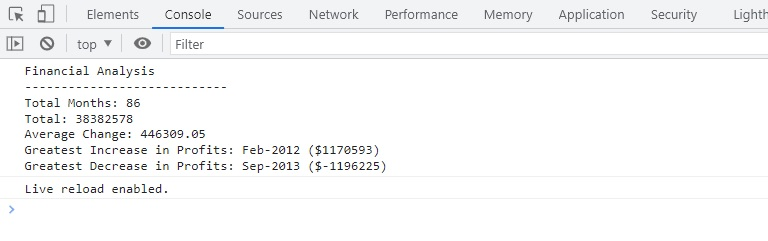
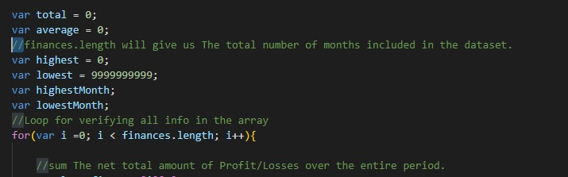
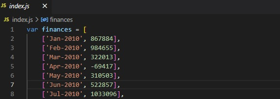

# Console-Finances
Analysis of financial records using javascript

## Description 

This is a JavaScript (JS) application that analyses financial data and outputs the results to the Console Log. 

As a front-end web developer javascript is an important scripting language that enables the implementation of complex features on a web page, it can be deployed to create dynamically updating content, control multimedia, animate images, and has many other uses besides.

I have developed this JS app to demonstrate a real-world situation utilising a financial dataset.

During the development of this app I have learned and applied the following;

<ul> 
    <li><strong>Pseudocoding</strong> - Planning is an important part of working out how to develop an app, pseudocode enables you to understand the individual steps and logic required from start to finish.</li>    
    <li><strong>Variables</strong> - Identify & declare variables containing primitive data types</li>
    <li><strong>Arrays</strong> - An array is a single variable that is used to store different elements.</li>
    <li><strong>for</strong> - A control flow statement for specifiying iteration, which allows code to be executed repeatedly</li>
    <li><strong>if</strong> - A statement to specify a block of JS code to be executed if a condition is true</li>
    <li><strong>console.log</strong> - A statement that prints content to the debugger</li>

</ul> 

### The Result -  
<i>Figure 1. My financial analysis app as viewed in console log.</i>

### Here is the deployed app; 
https://sam010000101.github.io/Console-Finances/

## Table of Contents

* [Installation](#installation)
* [Usage](#usage)
* [Credits](#credits)
* [License](#license)

## Installation

N/A

## Usage 
Pseudocode is included within the script file to demonstrate what each step does;

<i>Figure 2. The pseudocode</i>

A financial dataset is already provided, in order to analyse other datasets simply replace the existing array set ensuring that the same syntax is maintained i.e. ['string', number];

<i>Figure 3. The financial dataset</i>

## Credits

This project was created in collaboration with my teamates, big shouts out to;
    <li>Guilherme Deretti https://github.com/GuilhermeDeretti</li>
    <li>Victor  Biscio https://github.com/reinkaoss</li>
    <li>Vittoria Bugana https://github.com/vbugana</li>

## License

MIT License

Copyright (c) 2022 Sam Brooke

Permission is hereby granted, free of charge, to any person obtaining a copy
of this software and associated documentation files (the "Software"), to deal
in the Software without restriction, including without limitation the rights
to use, copy, modify, merge, publish, distribute, sublicense, and/or sell
copies of the Software, and to permit persons to whom the Software is
furnished to do so, subject to the following conditions:

The above copyright notice and this permission notice shall be included in all
copies or substantial portions of the Software.

THE SOFTWARE IS PROVIDED "AS IS", WITHOUT WARRANTY OF ANY KIND, EXPRESS OR
IMPLIED, INCLUDING BUT NOT LIMITED TO THE WARRANTIES OF MERCHANTABILITY,
FITNESS FOR A PARTICULAR PURPOSE AND NONINFRINGEMENT. IN NO EVENT SHALL THE
AUTHORS OR COPYRIGHT HOLDERS BE LIABLE FOR ANY CLAIM, DAMAGES OR OTHER
LIABILITY, WHETHER IN AN ACTION OF CONTRACT, TORT OR OTHERWISE, ARISING FROM,
OUT OF OR IN CONNECTION WITH THE SOFTWARE OR THE USE OR OTHER DEALINGS IN THE
SOFTWARE

---

## Badges

## Tests
Open browser > open inspector (i.e. browser development tools) > select "Console" to view results.
 
The console log displays the results specified in the acceptance criteria for wk4 challenge, see screenshot below;

---

© 2022 Trilogy Education Services, LLC, a 2U, Inc. brand. Confidential and Proprietary. All Rights Reserved.
# Console-Finances
